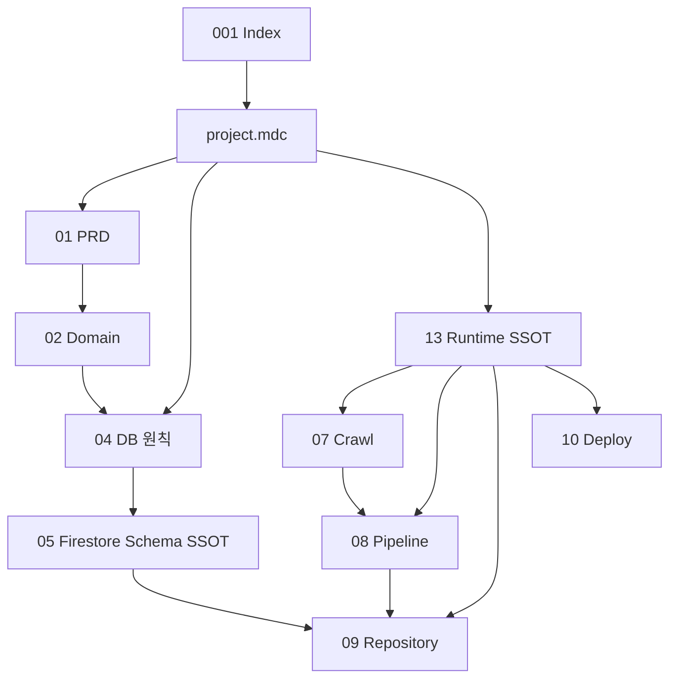
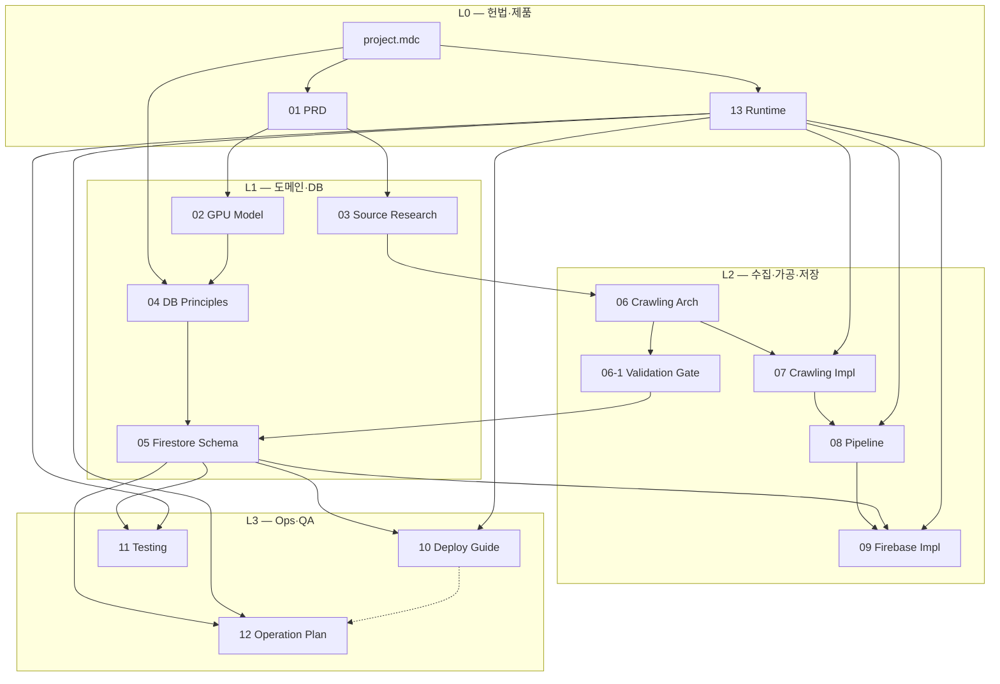
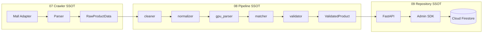
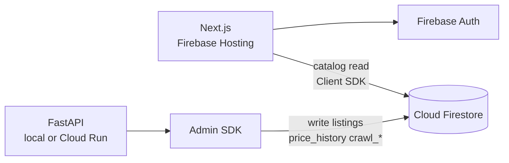
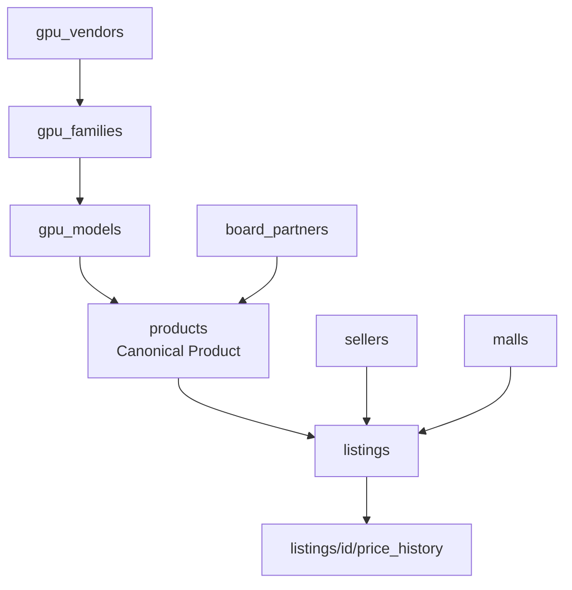

# 001. PriceBrain Documentation Flowchart

- Project: PriceBrain (프라이스브레인)
- Document: Documentation Index & Flow
- Version: 2.0
- Status: Final
- 작성일: 2026-08-19
- 갱신일: 2026-08-20 (Firestore SSOT 정렬 — Phase 3)
- **현행 DB SSOT:** Cloud Firestore — `docs/05_FIREBASE_DATA_STRUCTURE.md`
- **Runtime SSOT:** `docs/13_SERVICE_AND_RUNTIME_ARCHITECTURE.md`

---

## 1. SSOT 계층 (요약)



| SSOT | 파일 | 역할 |
|------|------|------|
| 헌법 | `.cursor/rules/project.mdc` | 기술 스택·원칙 |
| Schema | `05_FIREBASE_DATA_STRUCTURE.md` | Collection·Field·Rules·Index |
| Runtime | `13_SERVICE_AND_RUNTIME_ARCHITECTURE.md` | read/write·FastAPI·Hosting |
| 원칙 | `04_DATABASE_DESIGN.md` | Firestore 정책 (Schema X) |

---

## 2. 문서 목록 (전체)

| 번호 | 파일명 | 상태 | 한 줄 요약 |
|------|--------|------|------------|
| 001 | `001-flowchart.md` | v2.0 Final | 문서 인덱스·흐름·Gate |
| 01 | `01_PRD_PriceBrain.md` | v0.2 Draft | 제품·MVP·Phase |
| 02 | `02_GPU_Data_Model.md` | v0.2 Draft | GPU 도메인 엔티티 |
| 03 | `03_DATA_SOURCE_RESEARCH.md` | v0.2 Draft | 데이터 소스 조사 |
| 04 | `04_DATABASE_DESIGN.md` | v2.0 Final | Firestore 설계 **원칙** |
| **05** | **`05_FIREBASE_DATA_STRUCTURE.md`** | **v2.0 Final** | **Firestore Schema SSOT** |
| 06 | `06_DATA_SOURCE_AND_CRAWLING_ARCHITECTURE.md` | v0.2 Draft | 수집 아키텍처 |
| 06-1 | `06-1_DATA_SOURCE_VALIDATION.md` | v0.2 Draft | Collection Mapping Gate |
| 07 | `07_CRAWLING_IMPLEMENTATION_DESIGN.md` | v1.1 Final | Crawler·Parser·**Raw** |
| 08 | `08_DATA_PIPELINE_AND_NORMALIZATION.md` | v1.1 Final | Pipeline·Normalizer·Matcher |
| 09 | `09_FIREBASE_IMPLEMENTATION.md` | v2.0 Final | Repository·Admin SDK |
| 10 | `10_Deployment_and_Operations_Guide.md` | v1.1 | Firebase 초기 설정·Emulator |
| 11 | `11_Testing_and_Quality_Assurance_Guide.md` | v1.1 | Rules·CRUD 테스트 |
| 12 | `12_Deployment_and_Operation_Plan.md` | v1.1 | 운영·배포·비용 |
| **13** | **`13_SERVICE_AND_RUNTIME_ARCHITECTURE.md`** | **v1.0 Final** | **Runtime read/write SSOT** |

> **폐기 파일명:** `05_ERD_PriceBrain.md`, `canonical_products` Collection — 사용하지 않음.

---

## 3. 문서 의존 관계 (권장 읽기 순서)



---

## 4. 07 → 08 → 09 데이터 파이프라인



| Collection (Canonical) | 이름 |
|------------------------|------|
| Product (Canonical) | **`products`** |
| Seller Listing | **`listings`** |
| Price History | **`listings/{id}/price_history`** |

---

## 5. Runtime read/write (13 · 09 · 10 정합)



| 경로 | SDK | SSOT |
|------|-----|------|
| Catalog read | Client SDK | **13 §4** |
| Catalog write | Admin SDK via FastAPI | **09 §2**, **13 §4** |
| Rules·Index | `firestore.rules` | **05 §6–§7** |

---

## 6. GPU 도메인 ↔ Firestore (02 · 05)



상세 Field: **05 §3**. 02 매핑: **05 §8**.

---

## 7. Implementation Gate (개요)

| Gate | 내용 | 관련 문서 |
|------|------|-----------|
| **A** | Doc SSOT 정렬 | 001, 04, 05, 13 |
| **B** | 06-1 SSG 샘플 + Collection Mapping | 06-1 §28, **05** |
| **C** | Emulator + Rules (**11 §9**) | 10, 11, **05 §6** |
| **D** | 07→08→09 E2E 코드 | 09, Gate C 이후 |

> Phase 4 교차 검증 매트릭스는 Gate A Pass 후 별도 실행.

---

## 8. PRD Phase ↔ 문서

| PRD Phase | 문서 |
|-----------|------|
| Phase 0 기획 | 01, 02, 03 |
| Phase 1 데이터 | 04, **05**, 06, 06-1, 07, 08, 09 |
| Phase 2 분석 | (코드) + 02 도메인 |
| Phase 3 웹 | 13, 10, Frontend |
| Phase 5 배포 | 10, 12, Firebase Hosting |

---

## 9. 코드 디렉터리 (`pricebrain_app`)

```text
pricebrain_app/
├── crawler/       # 07
├── pipeline/      # 08
├── repository/    # 09
├── api/           # FastAPI
└── runner.py      # 07→08→09
```

---

## 10. 10 vs 12

| 문서 | 역할 |
|------|------|
| **10** | 개발 환경·Firebase 초기 설정·Emulator·SDK |
| **12** | 운영·배포·장애·비용·체크리스트 |

중복 절은 **12**에서 **10** 링크.

---

## 11. Design History (Non-SSOT)

| 과거 | 현행 |
|------|------|
| PostgreSQL + ERD | **Cloud Firestore** + **05** |
| `05_ERD_PriceBrain.md` | **`05_FIREBASE_DATA_STRUCTURE.md`** |
| RTDB `canonical_products` | **`products`** Collection |
| Web → API only DB read | Catalog **Client SDK read** (**13**) |

---

## 12. 변경 이력

| Version | Date | Note |
|---------|------|------|
| 1.0 | 2026-08-19 | docs 01~08 기준 (PostgreSQL/ERD) |
| 2.0 | 2026-08-20 | Firestore SSOT·13 Runtime·전 doc 인덱스 |
